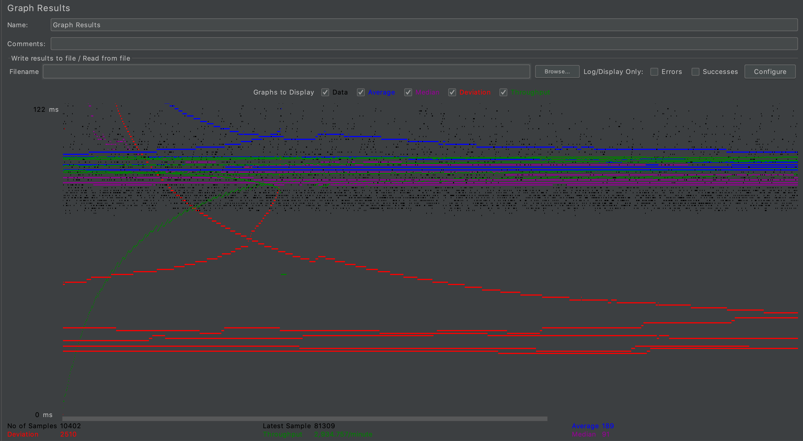
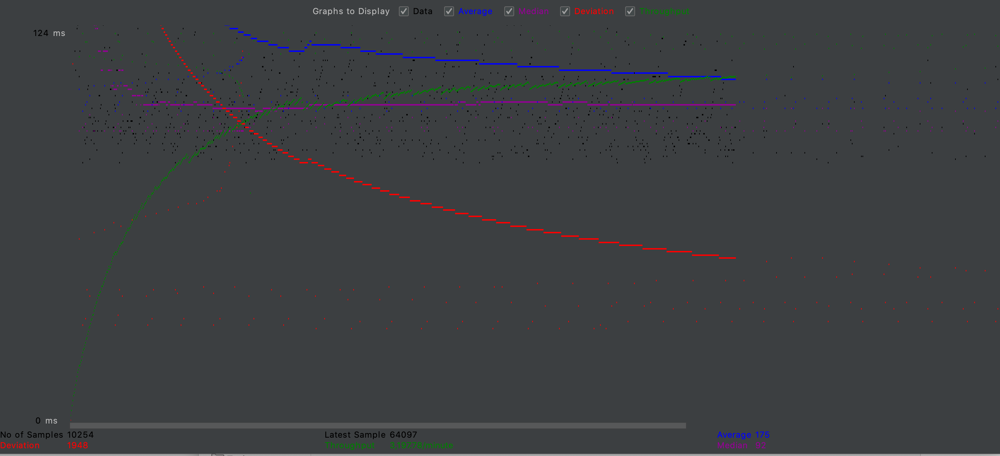

# cs122b-spring20-team-60
cs122b-spring20-team-60 created by GitHub Classroom

### Note: We put the original Fabflix (8080 port) and the load balancer (80 port) on the same AWS instance. So We have 3 AWS instances and 1 GCP.
- # General
    - #### Team#: 60
    
    - #### Names: Jingwen Mo, Chenxi Yang
    
    - #### URL: 
        scaled: http://18.220.12.68:80  
        original website: https://18.220.12.68:8443
    
    - #### Project 5 Video Demo Link: https://youtu.be/lGPPOcAW6O0

    - #### Instruction of deployment:   
    cd Project5 && sudo sh ./deploy.sh

    - #### Collaborations and Work Distribution:  
    Chenxi Yang:
    1. task 3 -- Enabled load balancer and routing queries to Master/Slave SQL respectively
    2. task 4 -- Prepared the codebase for measurement and wrote the processing script; Solved the login issue in testing and preparing the test plan in JMeter
    
    Jingwen Mo:
    1. task 1 -- Connection pooling in Spring boot
    2. task 2 -- Master-Slave Replication
    3. task 3 -- Enabled load balancer in aws and gcp
    4. task 4 -- tested and measured the performance, and collected the results
    

- # Connection Pooling
    - #### filename/path of all code/configuration files in GitHub of using JDBC Connection Pooling.
    Project5/src/main/resources/application.properties
    Project5/src/main/java/com/cs122b/project/Fabflix/Service/DBService.java
    
    - #### Explain how Connection Pooling is utilized in the Fabflix code.  
    Firstly, we configure the connection pooling in spring boot by do the configuration in application.properties, then spring will create a bean for us, and we can inject this DataSource bean and use it to get connection with MySQL.
    
    - #### Explain how Connection Pooling works with two backend SQL.
    There are two datasources(Thread pool) in our project, the datasource is binded and connect to the local slave SQL, only for reading data, the writedatasource is connected to the master SQL, and is used to perform write operation. The dbservice request connection from datasources and close that connection after work is done. For the search dbservice, Spring AOP is used for performance monitoring.
    

- # Master/Slave
    - #### Include the filename/path of all code/configuration files in GitHub of routing queries to Master/Slave SQL.  
    Project5/src/main/resources/application.properties
    Project5/src/main/java/com/cs122b/project/Fabflix/Service/DBService.java

    - #### How read/write requests were routed to Master/Slave SQL?
    We configured two datasources in [application.properties](./Project5/src/main/resources/application.properties), one for read, one for write, and we connect the write datasoure with the master slave. When we have to insert or update the database we use the read datasource.

- # JMeter TS/TJ Time Logs
    - #### Instructions of how to use the `log_processing.*` script to process the JMeter logs.
    ```
    pip install jsonlines
    python3 log_processing.py test01.log
    ```


- # JMeter TS/TJ Time Measurement Report

| **Single-instance Version Test Plan**          | **Graph Results Screenshot** | **Average Query Time(ms)** | **Average Search Servlet Time(ms)** | **Average JDBC Time(ms)** | **Analysis** |
|------------------------------------------------|------------------------------|----------------------------|-------------------------------------|---------------------------|--------------|
| Case 1: HTTP/1 thread                          |    | 119                         | 2.934646327857861                                  | 2.7373635035199464                        | The average query time JMeter calculated is 119, which is the whole time spent from sending the request to receiving the response. TS is aroud 2.93 while JS is aroud 2.73, we can see that TS>TJ, which satisfied our expectation that TJ is part of TS. Time diffence between AQT and TS is the time spent in the network transmit, which is much larger than TS.           |
| Case 2: HTTP/10 threads                        |    | 189                         | 13.760883089491918                                 | 13.730279687259431                        | We can see that 10 thread is slower than 1 thread since the load for the server is heavier and TS>TJ, which satisfied our expectation            |
| Case 3: HTTPS/10 threads                       |    | 175                         | 17.3745397431918                                 | 17.31245554104441                       | We can see that https is slower than http and TS>TJ, which satisfied our expectation            |
| Case 4: HTTP/10 threads/No connection pooling  |    | 492                         | 77.68907252533053                                  | 49.86028800994501                        | We can see that no connection pooling is slower than using connection pooling and TS>TJ, which satisfied our expectation            |

| **Scaled Version Test Plan**                   | **Graph Results Screenshot** | **Average Query Time(ms)** | **Average Search Servlet Time(ms)** | **Average JDBC Time(ms)** | **Analysis** |
|------------------------------------------------|------------------------------|----------------------------|-------------------------------------|---------------------------|--------------|
| Case 1: HTTP/1 thread                          |    | 117                         | master:3.531809883097542, slave:3.7946399822747416, avg:3.66                                  | master:3.187468437825763, slave:3.468511991875923, avg:3.33                        | We can see that the previous single version is slower than this scaled version since we have two servers to splite the incoming request flow and TS>TJ which satisfied our expectation            |
| Case 2: HTTP/10 threads                        |    | 273                         | master: 5.0240276454654555, slave:4.204780390688259, avg:4.61                                  | master:4.860670053831647, slave:4.11700182388664, avg:4.49                        | We can see that the previous single version is slower than this scaled version  and TS>TJ which satisfied our expectation; Also 10 thread is slower than 1 thread since the load for the server is heavier           |
| Case 3: HTTP/10 threads/No connection pooling  |    | 175                         | master:49.95578317359235, slave:10.402232293506493, avg:30.18                                  | master:41.909705471535425, slave:9.289837856623377, avg:25.6                        | We can see that the previous single version is slower than this scaled version and no connection pooling is slower than using connection pooling and TS>TJ, which satisfied our expectation           |


## Project4

## DemoURL:

Website:  
http://18.188.106.209:8080/   
https://18.188.106.209:8443/   

Video: https://youtu.be/JqRsP_cgLZA

## Deployment:

Website: cd Project3 && sudo sh deploy.sh

## FrontEnd:

the code for frontend auto-complete:  https://github.com/UCI-Chenli-teaching/cs122b-spring20-team-60/blob/master/FrontendSource/Customer/src/views/Search.vue

**Note: For the frontend, we use Vue.js framework. Since the aws EC2 instance has limited memory and CPU, we can not install vue-cli, which is essencial to build the forntend on the server, therefore we can not demo build on the EC2.  We can only build it locally and deploy the built target to our website resource folder**

## Contribution:
Jingwen Mo:
1. Implement full-text search
2. Implement backend for Autocomplete
3. Implement Android Login and Movie List Page

Chenxi Yang:
1. Implement frontend for Autocomplete
2. Implement Android Search and Single Movie Page


## Project3

## DemoURL:

Website:  
http://18.188.106.209:8080/   
https://18.188.106.209:8443/   
Video: https://www.youtube.com/watch?v=ehVolnZzvEc

## deployment instr:

Website:  ``cd Project3 && sudo sh deploy.sh``

DataImport: ``cd Datainsert/dbinsert && sudo sh run.sh``

## Prepared Statements:
[DBService.java](./Project3/src/main/java/com/cs122b/project/Fabflix/Service/DBService.java)

## Two parsing time optimization strategies:

1. In-memory hashmap: use hashmap to reduce duplication and drop no-matching data(invalied foreign key in stars_in_movies)

2. bulk insert for all table

note: star id is generated using MD5(starname).substring(0,7)+'0'

## Inconsistent data report from parsing：

https://personalmicrosoftsoftware-my.sharepoint.com/:f:/g/personal/chenxy2_personalmicrosoftsoftware_uci_edu/Eks42YYnlndBoLE-kJbrnfYB9UEvBCLzi-iBCW1iyMf5rA?e=Ptjs8h

## Api Design:
This is our api design document. Our front end and back end communicate base on this.

[Check API.md](./api.md)


## contribution

Jingwen Mo:
1. Add reCAPTCHA
2. Refractor original datebase query to preparedStatement
3. Use encrypted password
4. Implement the backend for admin login and Dashboard and also the stored procedure.
5. Debug and test

Chenxi Yang:
1. Adding HTTPS(Springboot)
2. Implement the frontend for admin login and Dashboard
3. Implement XML parsing and optimization
4. Debug and test


## Project2
## DemoURL:

Website: http://18.188.106.209:8080/ 
Video: https://youtu.be/lAAsxAHhy08

## deployment instr:

``sh ./deploy.sh``

## substring Design:

**Index creation:**

```sql
use moviedb;
CREATE INDEX movietitle ON movies (title);
CREATE INDEX moviedirector ON movies (director);
CREATE INDEX starname ON stars (name);
```

**Query:**

```sql
select * from movies where 1=1 AND movies.title LIKE "%t%" AND movies.year = 2003 AND movies.director like "%d%" and id in (select distinct movieId from stars_in_movies inner join stars on stars_in_movies.starId = stars.id where name like '%s%') ORDER BY movies.title asc , (select rating from ratings where ratings.movieId=movies.id) asc LIMIT 10 OFFSET 0;
```

note: ``where 1=1`` is designed for the convience of query formatting, make no sense in query.

## Api Design:
This is our api design document. Our front end and back end communicate base on this.

[Check API.md](./api.md)


## contribution

Jingwen Mo:
1. Refactoring the back end stucture from original Spring MVC(project 1) to Spring boot & RESTful
2. Design api and implement the back end using Spring boot, Spring MVC and REST and also develop all the database operations
3. Debug and test

Chenxi Yang:
1. Design api and implement the front end using Vue.js framework and make the UI look nicer.
2. Participate in developing the "search" database operations and improve the performance of backend database operations
3. Debug and test

